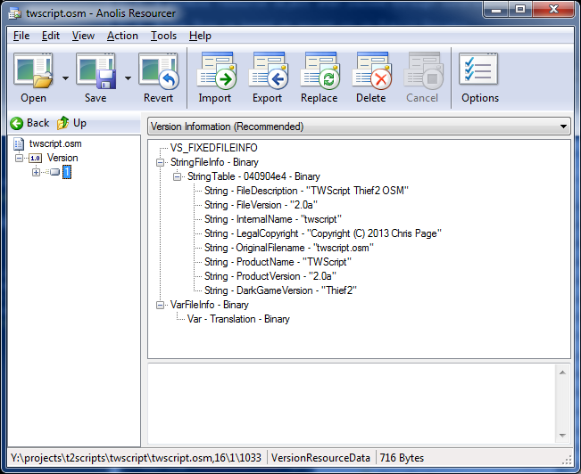

## twscript.osm version information

It's an unfortunate side effect of software development that, as time passes,
new versions of the software will need to be released[^1]. This means that there
will inevitably come a time where you need to work out which version of a given
piece of software you actually have. There are a number of approaches out there
to make it easier for the end-user to work out which version of something they
have, but unfortunately pretty much none of them can be used for .osm files.

However, each .osm file contains a 'Windows Resource' block; a chunk of data
that, among other things, stores the version information.

### Reading the resource data

Unfortunately, .osm files, and the windows resource data within them, are not
human-readable. In order to find out which version of a .osm file you are looking
at, you need to use a resource viewer or editor. One very easy to use example
of this is called [Anolis Resourcer](http://www.codeplex.com/anolis).

- Download Anolis Resourcer by clicking the "download" link on the page linked
  above.

- Unzip the archive you have downloaded.

- Run the `Resourcer.exe` program.

- Click 'Open' in the toolbar.

- In the file requester, change the file filter to `All Files (*.*)`

- Locate the .osm file you want to obtain the version of and click 'Open'

- In the left part of the Anolis Resourcer window you should now see the name
  of the .osm file with a `+ - 1.0 Version` line below it.

- Click on the `+` to open the next level, you should now see a line with
  `+ - 1` on it. Click on the `1` and the right side of the window should
  show the version information, something like that shown here:

In the version information you can see `String - FileVersion`; that's the
version of the .osm file you've opened.

[^1]: If this doesn't happen, it means that the software has been abandoned.
